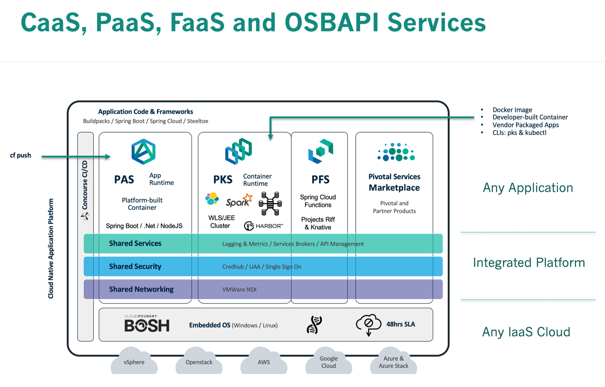

# Pivotal: Transforming How The World Builds Software

## 06/12/2019 Agenda
### (9:30AM to 3:30PM Breakfast & Lunch Included)

- Pivotal Mission & Applicability to our Customers
     - Value Statement
     - Case Studies
-  PCF Installation Steps
     - Operations Manager
     - Tile(s) Installation
- Demo & Hands-on
     - Developer Experience
        - PAS & PKS
     - Day 2 Operations
        - Scaling
        - Health Monitoring
        - Patching
        - Upgrading
     - Pivotal Container Service (Kubernetes) workload deployment
     - Pivotal Application Service for higher level developer productivity
- Pivotal Data Update and Q&A
- Next Steps

## Technical Pre-Requisites
- Ability to access https://chess.cfapps.io
- Ability to ssh into VMs with public IP addresses e.g. `ssh ubuntu@test.pcf4u.com`
- Ability to access and update this [Workshop Google Sheet](https://drive.google.com/open?id=1YcaNLkBqXHgYZch6yV8Kvf2G2AUG-trKSQQvejpstv8)

## Value Statement
- Enterprises rely on software to improve business outcomes.
- They depend on velocity of converting ideas to new features, new applications, new capabilities, and new services.
- This pace of change is generating a daunting backlog of work for IT leaders, who are also under pressure to reduce technology spend and limit security vulnerabilities.
- These competing mandates - velocity, security, and operational efficiency - force enterprises to re-evaluate how they develop, architect, and operate software. 
- Pivotal meets enterprises wherever they are on this journey and helps them accelerate their transition to continuous delivery, reducing waste (costs and time) through process and automation to achieve world-class efficiency and productivity.
- The business outcomes that Pivotal’s customers are achieving are compelling by any standard.

## Case Studies

https://pivotal.io/customers

## PCF Architecture, Installation & Set-up 

### LAB-1: ssh into your Linux Workshop environment & test Command Line Interface tools

Use the [Workshop Google Sheet](https://drive.google.com/open?id=1YcaNLkBqXHgYZch6yV8Kvf2G2AUG-trKSQQvejpstv8) to claim a user-id for this workshop. For example, Ralph Meira is user1.

`$ ssh -i ./fuse.pem ubuntu@user1.ourpcf.com`

Once logged in, execute the following commands:

`pks --version`

`kubectl version`

`cf --version`

If all the commands shown above completed without problems, you have successfully completed Lab 1.

Please update the [Workshop Google Sheet](https://drive.google.com/open?id=1YcaNLkBqXHgYZch6yV8Kvf2G2AUG-trKSQQvejpstv8) with an "x" in the appropriate column.

# 
