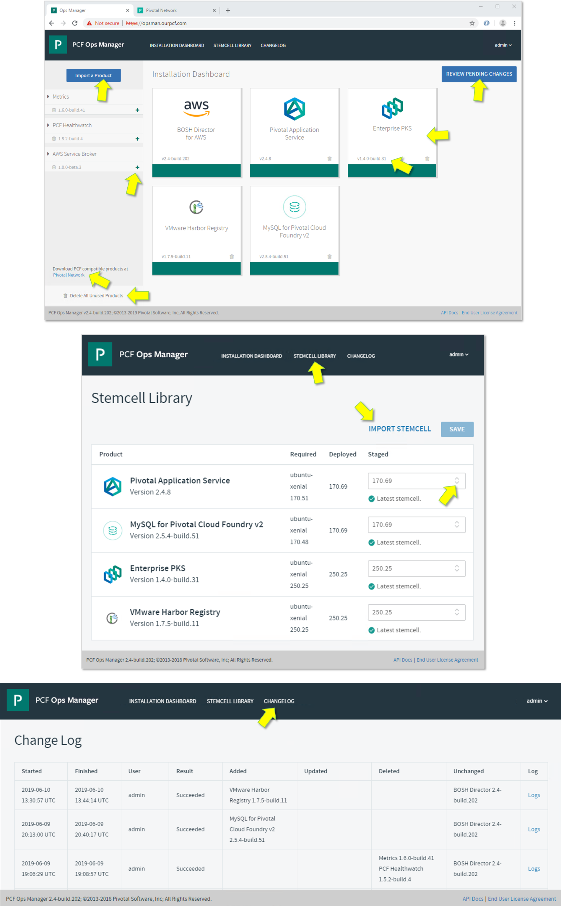

# Transforming How The World Builds Software

## 06/12/2019 Agenda
(9:30AM to 3:30PM Breakfast & Lunch Included)

- Pivotal Mission & Applicability to our Customers
     - Value Statement
     - Case Studies
-  PCF Installation Steps
     - Operations Manager
     - Tile(s) Installation
- Demo & Hands-on
     - Developer Experience
        - PAS & PKS
     - Day 2 Operations
        - Scaling
        - Health Monitoring
        - Patching
        - Upgrading
     - Pivotal Container Service (Kubernetes) workload deployment
     - Pivotal Application Service for higher level developer productivity
- Pivotal Data Update and Q&A
- Next Steps

## Technical Pre-Requisites
- Ability to access https://chess.cfapps.io
- Ability to access and update this [Workshop Google Sheet](https://drive.google.com/open?id=1YcaNLkBqXHgYZch6yV8Kvf2G2AUG-trKSQQvejpstv8)
- Ability to ssh into a Ubuntu VM (public IP address) using a private-key file 

  e.g. `ssh -i fuse.pem ubuntu@user1.ourpcf.com`
  - [fuse.pem](https://github.com/rm511130/PCF4CAS/blob/master/fuse.pem) must be set using `chmod 400` to read-only by owner
  - I using Powershell on a Windows machine read these [instructions](https://superuser.com/questions/1296024/windows-ssh-permissions-for-private-key-are-too-open)

## Guidelines for this Workshop
- This workshop includes presentations, demos and hands-on labs. 
- The labs are interdependent and must be executed in order.
- Use the [Workshop Google Sheet](https://drive.google.com/open?id=1YcaNLkBqXHgYZch6yV8Kvf2G2AUG-trKSQQvejpstv8) to claim a user-id for this workshop. For example, Ralph Meira is user1.
- Update the [Workshop Google Sheet](https://drive.google.com/open?id=1YcaNLkBqXHgYZch6yV8Kvf2G2AUG-trKSQQvejpstv8) as you progress through the Labs, by placing an "x" in the appropriate column.
- When carrying out hands-on labs, you can simply cut-&-paste the commands shown `in boxes like this one`. 
- When issuing commands, please make sure to alter the user-id to match the one you have claimed, e.g.:
  - `ssh -i fuse.pem ubuntu@user3.ourpcf.com` is for `user3` 
  - `ssh -i fuse.pem ubuntu@user15.ourpcf.com` is for `user15`

## Pivotal Beliefs: Value Statement
- Enterprises rely on software to improve business outcomes.
- They depend on velocity of converting ideas to new features, new applications, new capabilities, and new services.
- This pace of change is generating a daunting backlog of work for IT leaders, who are also under pressure to reduce technology spend and limit security vulnerabilities.
- These competing mandates - velocity, security, and operational efficiency - force enterprises to re-evaluate how they develop, architect, and operate software. 
- Pivotal meets enterprises wherever they are on this journey and helps them accelerate their transition to continuous delivery, reducing waste (costs and time) through process and automation to achieve world-class efficiency and productivity.
- The business outcomes that Pivotal’s customers are achieving are compelling by any standard.

## Case Studies

https://pivotal.io/customers

## PCF Architecture, Installation & Set-up 


### LAB-1: SSH into your Linux Workshop environment & test the Command Line Interface tools

Let's start by logging into the Workshop environment from your machine (Mac, PC, LapTop, Desktop, Terminal, VDI):

```
ssh -i ./fuse.pem ubuntu@user1.ourpcf.com
```

Once logged in, execute the following commands:

```
pks --version
```

```
kubectl version
```
If you see a connection refused message, don't worry, it is expected and not a problem.

```
cf --version
```

```
git version
```

If all the commands shown above displayed the CLI versions, you have successfully completed Lab 1.

Please update the [Workshop Google Sheet](https://drive.google.com/open?id=1YcaNLkBqXHgYZch6yV8Kvf2G2AUG-trKSQQvejpstv8) with an "x" in the appropriate column.

If you had to install the pks, kubectl and cf CLIs, you would need to download them from [PivNet](http://network.pivotal.io) and follow the instructions. 

### LAB-2: Connecting to PCF PAS (Pivotal Application Service)

If LAB-1 was successful, you should be logged into an Ubuntu VM on AWS. The following command will get you connected to PCF/PAS (Pivotal Application Service) - make sure to use the correct User# that you have claimed in the [Workshop Google Sheet](https://drive.google.com/open?id=1YcaNLkBqXHgYZch6yV8Kvf2G2AUG-trKSQQvejpstv8) 

```
cf login -a api.sys.ourpcf.com --skip-ssl-validation -u user1 -p password
```

You have landed in an ORG and SPACE that were created just for you to use and manage. ORGs are often used to isolate Business/App Programs and SPACEs are used to isolate DEV, TEST, and PROD. Let's continue:

```
cf create-space production
```

Grant a colleague of yours access to your `development` space. In the example below we'll use `user2` but you can pick anyone participating in this workshop.

```
cf set-space-role user2 org1 development SpaceDeveloper
cf space-users org1 development
```

Congratulations, you have completed LAB #2.


### LAB-3: The Haiku "Here is my source code, Run it on the cloud for me, I do not care how."

Let's continue from Lab #2 by grabbing some code from github.

```
cd ~    # just to make sure you are in your home directory
git clone https://github.com/rm511130/chess; cd chess; ls -las
```

Your code is in the `cat index.php` file. It's a ♞ Chess Game written in Javascript.
The `cat manifest.yml` states that your code requires 100MB of RAM and a random URL to avoid collision with other colleagues.

Let's `cf push` your Chess App.

```
cf push
```

Once the process has been completed, you should look for the random route URL that PAS created for you. The output will look something like this:

```html
name:              chess
requested state:   started
routes:            chess-intelligent-oryx.apps.ourpcf.com
last uploaded:     Fri 07 Jun 18:02:10 UTC 2019
stack:             cflinuxfs3
buildpacks:        php 4.3.70
```

Access your route / URL or ask someone to access it. You should see someything similar to this:


Let's recap: you have deployed a Chess App into the cloud without having to worry about IP addresses, ports, middleware, containers, VMs, network routers, application routes, DNS entries, app logging, app performance monitoring, firewalls, etc..

You can easily scale horizontally by increasing the number of containers running your Chess App, and you can log into any specific container. Let's try this:

```
cf scale chess -i 3
cf ssh chess -i 2
set   
exit
```

Let's recap: you just scaled from 1 to 3 (not a limit) containers running the same Chess App. PAS provided automatic loadbalanced routing across all three containers, and you accessed the 3rd container - which is useful for debugging.  

Congratulations, you have completed LAB #3.


### LAB-4: Apps Manager & Ops Manager

Time is short so we will demonstrate the features of Ops Manager `http://opsman.ourpcf.com` to the workshop participants:



You can access Apps Manager `http://login.sys.ourpcf.com` using your User# and `password` for password.


We will also demonstrate the features of Apps Manager, but you are welcome to click around and learn about its features: events, services, routes, tasks, logs, traces, threads, settings, (auto)scaling, metrics, life-cyle management and health-management.

Congratulations, if you accessed Apps Manager successfully, you have completed Lab #4.


### LAB-5: PAS handles Docker Images and it's the best PaaS for running Spring Apps

Assuming that your are logged into your Ubuntu Workshop VM proceed as follows:

```
cf push factorial --docker-image rmeira/factorial --random-route 
```

Once deployed, you can test `factorial` by using a browser or a `curl` command per the example below:

```
curl factorial-courteous-toucan.apps.ourpcf.com/6; echo
```

You should see results similar to this: 


Let's `cf push` a Spring Boot application:

```
cd ~   # to make sure you are back to the your home directory
git clone https://github.com/rm511130/spring-music
cd spring-music
./gradlew clean assemble
cf push
```

PCF PAS uses its Java Buildpack to create a container with all the dependencies necessary to run your Spring-Music App.


Access `Apps Manager` and take a look at how it has recognized and reconfigured itself for the Docker and Spring Boot Apps. 

Congratulations, you have completed Lab #5.


