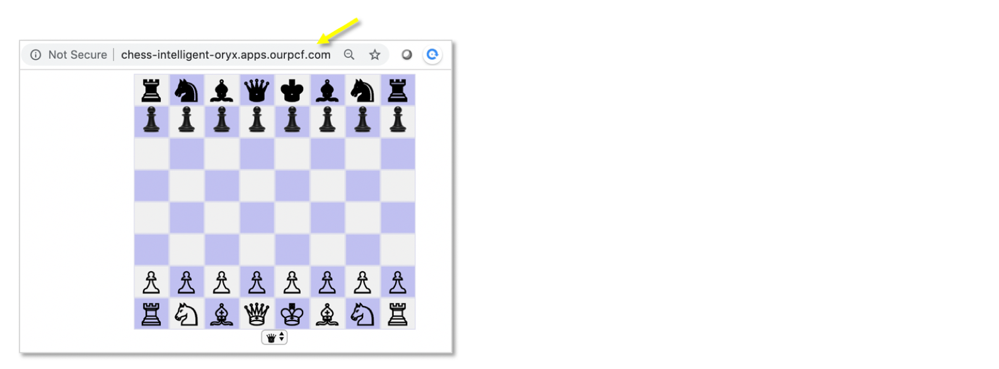
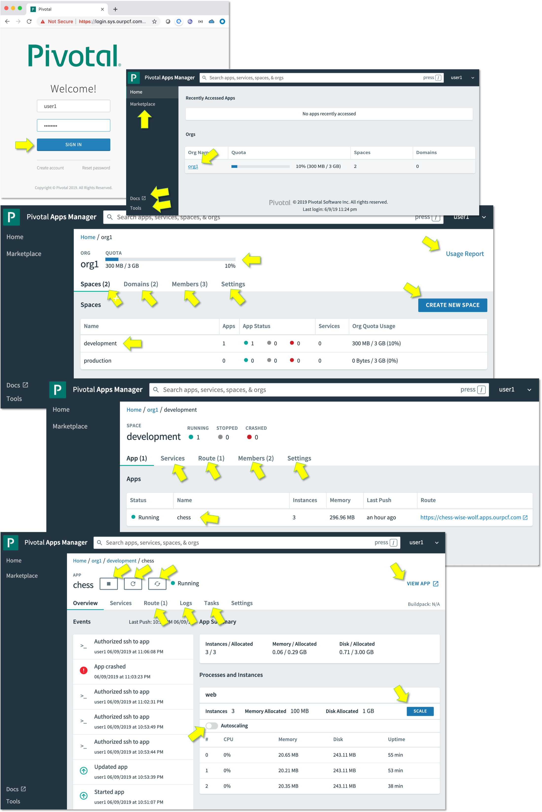
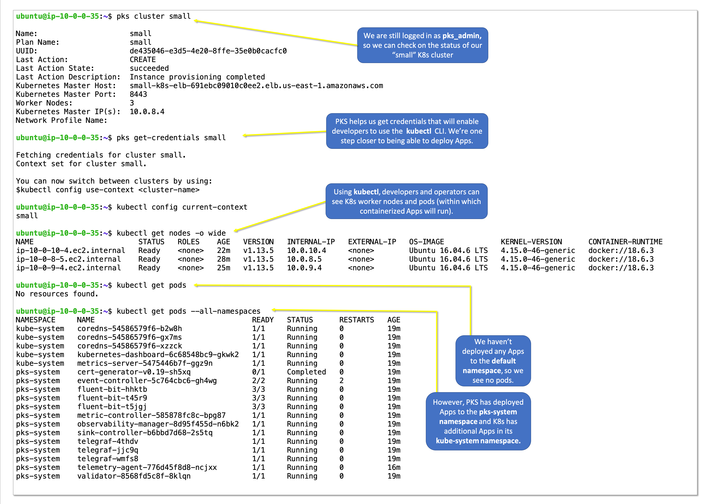
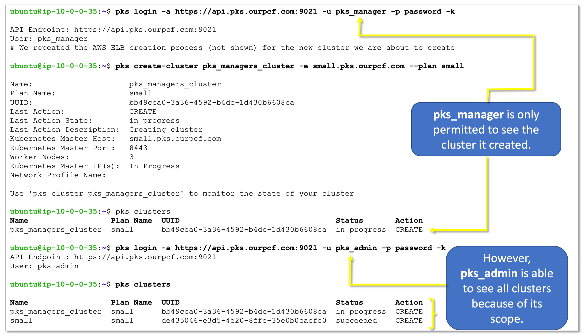

# Transforming How The World Builds Software
-----------------------------------------------------
## Workshop Agenda
(9:30AM to 3:30PM Breakfast & Lunch Included)

- Pivotal Mission & Applicability to our Customers
     - Value Statement
     - Case Studies
-  PCF Installation Steps
     - Operations Manager
     - Tile(s) Installation
- Demo & Hands-on
     - Developer Experience
        - PAS & PKS
     - Day 2 Operations
        - Scaling
        - Health Monitoring
        - Patching
        - Upgrading
     - Pivotal Container Service (Kubernetes) workload deployment
     - Pivotal Application Service for higher level developer productivity
- Pivotal Data Update and Q&A
- Next Steps
-----------------------------------------------------
## Technical Pre-Requisites
- A Mac or PC with internet connection, running a browser that can access https://chess.cfapps.io
- Ability to access and update this [Workshop Google Sheet](https://drive.google.com/open?id=1YcaNLkBqXHgYZch6yV8Kvf2G2AUG-trKSQQvejpstv8)
- Ability to SSH into a Ubuntu VM (public IP address) using a private-key file

  e.g. `ssh -i fuse.pem ubuntu@user1.ourpcf.com`
  - [fuse.pem](https://github.com/rm511130/PCF4CAS/blob/master/fuse.pem) must be set using `chmod 400` to read-only by owner
  - If using Powershell on a Windows machine read these [instructions](https://superuser.com/questions/1296024/windows-ssh-permissions-for-private-key-are-too-open)
  
-----------------------------------------------------

## Guidelines for this Workshop
- This workshop includes presentations, demos and hands-on labs. 
- The labs are interdependent and must be executed in order.
- Use the [Workshop Google Sheet](https://drive.google.com/open?id=1YcaNLkBqXHgYZch6yV8Kvf2G2AUG-trKSQQvejpstv8) to claim a user-id for this workshop. For example, Ralph Meira is user1.
- Update the [Workshop Google Sheet](https://drive.google.com/open?id=1YcaNLkBqXHgYZch6yV8Kvf2G2AUG-trKSQQvejpstv8) as you progress through the Labs, by placing an "x" in the appropriate column.
- When carrying out hands-on labs, you can simply cut-&-paste the commands shown `in boxes like this one`. 
- However, when issuing commands, please make sure to alter the user-id to match the one you have claimed, e.g.:
  - `ssh -i fuse.pem ubuntu@user3.ourpcf.com` is for `user3` 
  - `ssh -i fuse.pem ubuntu@user15.ourpcf.com` is for `user15`
- Don't get stuck. Ask for help. The goal is to learn concepts and understand how Pivotal can help CAS be successful.
- The PAS and PKS platforms we will be using were created using self-signed certificates, so you will sometimes have to click through warning screens about insecure pages.
- Each workshop participant will be assigned an Ubuntu VM on AWS which has been readied for the execution of hands-on Labs. Your Laptop or Desktop will be used for two purposes: 
     - SSH'ing into the Ubuntu VM 
     - Browsing web pages

-----------------------------------------------------

## Pivotal's Value Statements
- Enterprises rely on software to improve business outcomes.
- They depend on velocity of converting ideas to new features, new applications, new capabilities, and new services.
- The pace of change is generating a daunting backlog of work for IT leaders, who are also under pressure to reduce technology spend and limit security vulnerabilities.
- The competing mandates - velocity, security, and operational efficiency - force enterprises to re-evaluate how they develop, architect, and operate software. 
- Pivotal helps enterprises accelerate their transition to continuous delivery, reducing waste (costs and time) through process and automation to achieve world-class efficiency and productivity.
- Pivotal’s customers are achieving are compelling Business Outcomes.

-----------------------------------------------------


-----------------------------------------------------

## Case Studies

World-class teams of agile developers, product managers, and designers can adopt the [Pivotal way](https://pivotal.io/labs) of building and deploying software with quality and sustainable velocity in a cost-effective manner. The techniques Pivotal uses and advocates, involve Minimum Viable Products (MVPs), Lean experiments, Identifying & testing assumptions, Data driven decisions, User-centered designs, Prototyping, Pair Programming, Test-Driven Development (TDD), Short Iterations, Continuous Integration and Deployment.

The results are amazing:
- Build working software at a consistent speed and quality in the face of changing requirements.
- Ensure the software solves a real problem for real users in a desirable and usable product.
- Reduce the risk of building the wrong thing while comfortably changing direction.


https://pivotal.io/customers

-----------------------------------------------------

## PCF Architecture, Installation & Set-up 

- [Containers 101](https://drive.google.com/open?id=1vRisBwfNmD22o_d7OC_OWS9g-M2b2p_q)


- [PKS 1.4 on vSphere](https://drive.google.com/file/d/1Jwytpm-kO0trS-5vAUKRssSVCXv98G0o/view)


-----------------------------------------------------

### LAB-1: SSH into your Linux Workshop environment & test the Command Line Interface tools

Let's start by logging into the Workshop environment from your machine (Mac, PC, LapTop, Desktop, Terminal, VDI). You will need to use the following private key: [fuse.pem](https://github.com/rm511130/PCF4CAS/blob/master/fuse.pem).

```
ssh -i ./fuse.pem ubuntu@user1.ourpcf.com
```

Once logged in, execute the following commands:

```
pks --version
```

```
kubectl version
```
If you see a connection refused message, don't worry, it is expected and not a problem.

```
cf --version
```

```
git version
```

If all the commands shown above displayed their respective CLI versions, you have successfully completed Lab-1.

Please update the [Workshop Google Sheet](https://drive.google.com/open?id=1YcaNLkBqXHgYZch6yV8Kvf2G2AUG-trKSQQvejpstv8) with an "x" in the appropriate column.

Note: if you had to install the pks, kubectl and cf CLIs, you would need to download the binary files from [PivNet](http://network.pivotal.io) and place them under `/usr/local/bin` using `chmod +x` to make them executable.

-----------------------------------------------------

### LAB-2: Connecting to PCF PAS (Pivotal Application Service) 

Pivotal Application Service is the PaaS (Platform as a Service) component of the Pivotal Cloud Foundry ecosystem. It is the best place for developing and running applications (incl. Java, .NET, Spring, Node.js, Go, ...). PAS can be deployed on all major IaaS solutions (vSphere, OpenStack, GCP, AWS and Azure) to deliver a simple and consistent interface to Developers (Apps Manager, CF CLI) and Operators (Ops Manager, CF CLI, Bosh).


Assuming you completed LAB-1 successfully, you should be logged into an Ubuntu VM hosted on AWS. Using this VM, change the User_ID in the following command and execute it to connect to PCF/PAS (Pivotal Application Service) - make sure to use the correct User-ID, i.e. the one claimed in the [Workshop Google Sheet](https://drive.google.com/open?id=1YcaNLkBqXHgYZch6yV8Kvf2G2AUG-trKSQQvejpstv8) 

```
cf login -a api.sys.ourpcf.com --skip-ssl-validation -u user1 -p password      # change -u userX to match your User-ID
```

You will land in an ORG and SPACE that were created just for you to use and manage during this workshop. ORGs are often used to isolate Business/App-Programs/Products, and SPACEs are used to isolate Apps in DEV, TEST, and PROD phases. Let's continue:

```
cf create-space development
cf orgs; cf spaces
cf target -s development
```

Grant a colleague of yours access to your `development` space. In the example below we'll use `user2` but you can pick anyone participating in this workshop.

```
cf set-space-role user2 org1 development SpaceDeveloper
cf space-users org1 development
```

Let's recap: You have access to PAS (Pivotal Application Service), to an ORG and two spaces that can be used for your projects. You can develop code in the developement SPACE and promote it into the production SPACE.

Congratulations, you have completed LAB-2. 

-----------------------------------------------------

### LAB-3: The Developer's Haiku - "Here is my source code, Run it on the cloud for me, I do not care how."

Let's continue from Lab-2 by grabbing some code from github. Continue using your Ubuntu VM.

```
cf target -s development
cd ~    # just to make sure you are in your home directory
git clone https://github.com/rm511130/chess; cd chess; ls -las
```

Your code is in the `cat index.php` file. It's a ♞ Chess Game written in Javascript.
The `cat manifest.yml` states that your code requires 100MB of RAM and a random URL to avoid collision with other colleagues.

Let's `cf push` your Chess App.

```
cf push
```

Once the process has been completed, you should look for the random route URL that PAS created for you. The output will look something like this:

```html
name:              chess
requested state:   started
routes:            chess-intelligent-oryx.apps.ourpcf.com
last uploaded:     Fri 07 Jun 18:02:10 UTC 2019
stack:             cflinuxfs3
buildpacks:        php 4.3.70
```

Access your route / URL or ask someone to access it. You should see someything similar to this:



Let's recap: You have deployed a Chess App into the cloud, without having to worry about IP addresses, ports, middleware, containers, VMs, network routers, application routes, DNS entries, app logging, app performance monitoring, firewalls, etc., and you didn't have to open a service ticket. 

You can easily scale horizontally by increasing the number of containers running your Chess App, and you can log into any specific container. Let's try this:

```
cf scale chess -i 3
cf ssh chess -i 2
set   
exit
```

Let's recap: You just scaled from 1 to 3 (not a limit) containers running the same Chess App. PAS provided automatic loadbalanced routing across all three containers, and you accessed the 3rd container (by using `-i 2`) which is useful for debugging specific issues to any given container type or container instance.

Congratulations, you have completed LAB-3.

-----------------------------------------------------

### LAB-4: Apps Manager & Ops Manager

Time is short so we will demonstrate the features of Ops Manager, the operators GUI, `http://opsman.ourpcf.com` to the workshop participants:


You can access Apps Manager, the developers GUI, `http://login.sys.ourpcf.com` using your User# and `password` for password.



We will also demonstrate the features of Apps Manager, but you are welcome to click around and learn about its features: events, services, routes, tasks, logs, traces, threads, settings, (auto)scaling, metrics, life-cyle management and health-management.

Congratulations, if you accessed Apps Manager successfully, you have completed Lab #4.

-----------------------------------------------------

### LAB-5: PAS handles Docker Images and it's the best PaaS for running Spring Apps

Assuming that your are logged into your Ubuntu Workshop VM proceed as follows:

```
cf push factorial --docker-image rmeira/factorial --random-route 
```

Once deployed, you can test `factorial` by using a browser or a `curl` command per the example below:

```
curl factorial-courteous-toucan.apps.ourpcf.com/6; echo
```

You should see results similar to this: 


Let's `cf push` a Spring Boot application:

```
cd ~   # to make sure you are back to the your home directory
git clone https://github.com/rm511130/spring-music
cd spring-music
./gradlew clean assemble
cf push
```

PCF PAS uses its Java Buildpack to create a container with all the dependencies necessary to run your Spring-Music App.


Go back to [Apps Manager](http://login.sys.ourpcf.com) and take a look at how it has recognized and reconfigured itself for the Docker and Spring Boot Apps. 

Congratulations, you have completed Lab-5.

-----------------------------------------------------

### LAB-6: Installing the PKS Tile in Ops Manager

Lab-6 involves some reading. No actual hands-on keyboard will be necessary until we proceed to Lab-7. This is because the steps we describe below are for Operations to execute during the installation of PKS and during the creation of K8s Clusters.

- K8s (Kubernetes) is an open-source platform for building platforms. It is a system for automating the deployment, scaling, and management of containerized applications. 
- Pivotal Container Service (PKS) enables operators to provision, operate, and manage enterprise-grade Kubernetes clusters using BOSH and Pivotal Ops Manager.
- Neither of the two is a PaaS.


During this workshop we will show you many key aspects of the installation and set-up of the PKS Tile and the creation and management of K8s clusters. However, installimg PKS on any IaaS takes at least 1hr, so please watch this compressed [15min video](https://www.youtube.com/watch?time_continue=83&v=Oxw-lucgpX0) to get an idea of the steps involved.


The main steps for the creation of the environment in the diagram shown above are:

1. Set-up the networking infrastructure: e.g. install NSX-T or run Terraform scripts on your IaaS to create load balancers, reserve subnets, establish firewalls, service accounts with the correct permissions.
2. Download the Ops Manager VM bits or Image Metadata from [PivNet](https://network.pivotal.io) and install it on your IaaS
3. Set-up Ops Manager Director: creating Availability Zones, Networks, etc.
4. Download PAS and PKS Tiles from [PivNet](https://network.pivotal.io), import them into Ops Manager, add, set-up and apply.
    
Step 4 is shown in the installation video mentioned above, but it merits a deeper dive. Let's take a look at what happens after the PKS VM is up and running, and what steps are necessary to create a K8s cluster.

- Once the PKS VM is up and running and you have an ELB (Elastic Load Balancer) pointing to it, you can create a `pks_admin` and a `pks_manager` in the UAA (User Account & Authentication) server running inside the PKS VM.


- Using the AWS Console, let's create an AWS ELB (Elastic Load Balancer) in preparation for the creation of our first K8s cluster:


- Now that we have an ELB created for the K8s cluster we are about to create:


- The K8s Cluster is now almost ready to be handed over to developers whose tool of choice will be the **kubectl** CLI.



- Note that anyone with access to the `pks_admin` username and password is able to control all K8s clusters. We need more granularity for proper isolation between different software product development groups. You may recall that we also created a `pks_manager` with a different scope of responsibility - `pks.clusters.manage` - which limits the `pks_manager` (usually an operator) to see and manage clusters it creates. Let's see this is action:



- The PKS CLI allows administrators to create or delete K8s clusters. It also allows operators to resize (up or down) the number of worker nodes in a K8s clusters.

```
$ pks

The Pivotal Container Service (PKS) CLI is used to create, manage, and delete Kubernetes clusters. To deploy workloads to a Kubernetes cluster created using the PKS CLI, use the Kubernetes CLI, kubectl.

Version: 1.4.0-build.194

Usage:
  pks [command]

Available Commands:
  cluster                View the details of the cluster
  clusters               Show all clusters created with PKS
  create-cluster         Creates a kubernetes cluster, requires cluster name, an external host name, and plan
  create-network-profile Create a network profile
  create-sink            Creates a sink for sending all log data to syslog://
  delete-cluster         Deletes a kubernetes cluster, requires cluster name
  delete-network-profile Delete a network profile
  delete-sink            Deletes a sink from the given cluster
  get-credentials        Allows you to connect to a cluster and use kubectl
  get-kubeconfig         Allows you to get kubeconfig for your username
  help                   Help about any command
  login                  Log in to PKS
  logout                 Log out of PKS
  network-profile        View a network profile
  network-profiles       Show all network profiles created with PKS
  plans                  View the preconfigured plans available
  resize                 Changes the number of worker nodes for a cluster
  sinks                  List sinks for the given cluster
  update-cluster         Updates the configuration of a specific kubernetes cluster

Flags:
  -h, --help      help for pks
      --version   version for pks

Use "pks [command] --help" for more information about a command.
```

- The PKS set-up screens allow for LDAP integration which we are not using during this workshop. So we have also set up every developer's user-id directly in the PKS UAA database using commands similar to the one shown below:


**Let's Recap:** Lab-6 allowed you see the PKS installation steps and the process for the creation of K8s clusters - both involved some AWS (IaaS) set-up steps. You saw how the PKS CLI also help retrieve credentials for the use of the **kubectl** CLI, and you also saw that the PKS CLI enables the creation, resizing and deletion of clusters.

In the next lab we will hand-over the K8s clusters to developers.

-----------------------------------------------------

### LAB-7: Namespaces and Role Binding for Developer Access

In this lab we will cover cluster access, the creation of namespaces and role binding. You will get hands-on in a few minutes, but the first few steps are the responsibility of Operators and Administrators of the PKS platform.

== Cluster Access

. In the newly created cluster or existing cluster, log in as the cluster manager (or admin in case of existing cluster). The steps are the same irrespective of the role. 

----
pks login -a https://api.pks.pcf4labs.com -u westpksmanager -k

Password: ********
API Endpoint: https://api.pks.pcf4labs.com
User: westpksmanager
----

. Now we will run the get-credentials command so that this user can get the credentials to access the cluster. The credentials and cluster info comes as a config file that is created or appended by the get-credentials command.

----
pks get-credentials workshop-cluster

Fetching credentials for cluster workshop-cluster.
Password: ********
Context set for cluster workshop-cluster.

You can now switch between clusters by using:
$kubectl config use-context <cluster-name>
----

== Create custom developer role, k8s namespaces and role binding

* Now that the cluster manager (or admin) has PKS cluster access, for the purpose of this workshop, we will create a UAA user. This will simulate developers that can access this cluster. In reality, there would be either LDAP, SAML or SSO integration in place that will be mapped to UAA.


* Create UAA user 

----
uaac user add dev1 -p password --emails dev1@example.com 
user account successfully added
----

* Create the k8s namespace 

----
kubectl create namespace namespace01
namespace "namespace01" created
----

* Create a role reference definition file (role-namespace-admin.yaml) and apply it for this namespace.

----
kind: Role
apiVersion: rbac.authorization.k8s.io/v1
metadata:
  name: ns-admin
rules:
  - apiGroups: ["*"]
    resources: ["*"]
    verbs: ["*"]
----

Run the following command to apply it against the namespace

----
kubectl create -f role-namespace-admin.yaml -n namespace01
role "ns-admin" created
----

* Create a role binding file (rb-namespace01-admin.yaml) that maps the *dev1* user to this role and allows access to the k8s namespace.

----
kind: RoleBinding
apiVersion: rbac.authorization.k8s.io/v1
metadata:
  name: ns-admins
  namespace: namespace01
subjects:
  - kind: User
    name: dev1
roleRef:
  kind: Role
  name: ns-admin
  apiGroup: rbac.authorization.k8s.io
----

Apply it against the k8s namespace

----
kubectl create -f rb-namespace01-admin.yaml
rolebinding "ns-admins" created
----


- [Awesome K8s](https://ramitsurana.github.io/awesome-kubernetes/)


