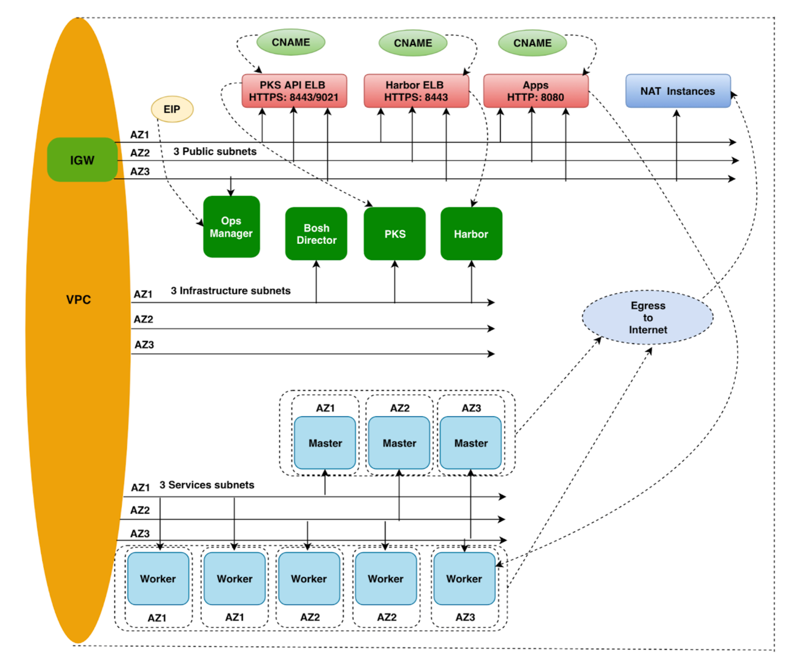
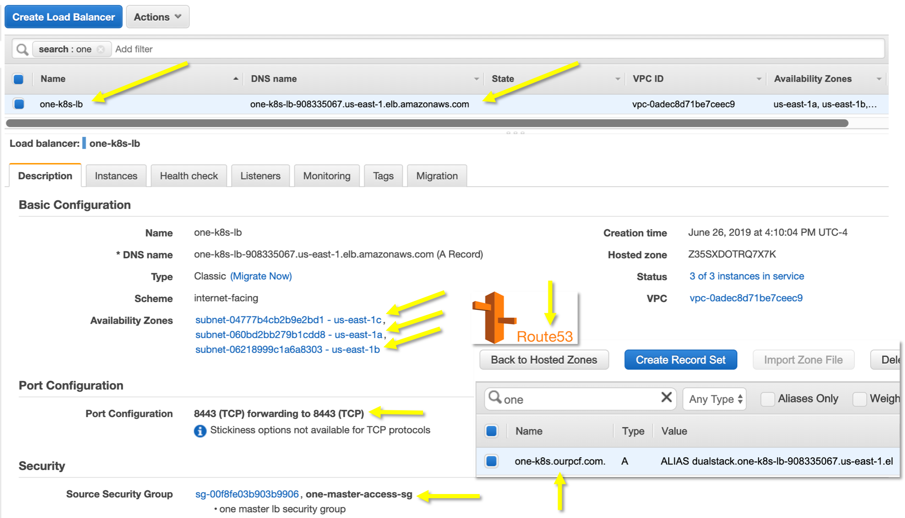

##### https://github.com/ronakbanka/manage-pks by Ronak Banka

# Creating PKS K8s Clusters using Manage-Cluster Utility

Assuming you have a PKS environment running on AWS. 



Assuming that you have the necessary CLIs:  pks, aws and jq.

```
ssh -i ~/Downloads/fuse.pem ubuntu@user24.ourpcf.com
pks login -a https://api.pks.ourpcf.com:9021 -u pks_admin -p password -k
ubuntu@ip-10-0-0-38:~/manage-pks/aws$ export ENV_NAME=pks
ubuntu@ip-10-0-0-38:~/manage-pks/aws$ export ROUTE_53_ZONE_ID=Z3IJH5GRT9EDF0
```

You can execute the following steps to install `manage-cluster` on your Mac:

```
git clone https://github.com/ronakbanka/manage-pks
cd manage-pks/aws
```

Let's make sure my `aws cli` is working:

```
$ aws configure
AWS Access Key ID [****************JETA]: 
AWS Secret Access Key [****************4Yfh]: 
Default region name [us-east-1]: 
Default output format [json]: 
```

A quick way to test your `aws cli`:

```
aws ec2 describe-instances | grep -i privateipaddress
```

# Creating a PKS Cluster using `manage-cluster provision`

Remember to make sure you are in the correct directory:

```
./manage-cluster 
Usage: ./manage-cluster {provision|access|cleanup}
```

OK, then lets create a cluster:

```
./manage-cluster provision
```
```
Enter pks cluster name to be created and press [ENTER]:
one
```
```
Listing pks plans...

Name    ID                                    Description
small   8A0E21A8-8072-4D80-B365-D1F502085560  Example: This plan will configure a lightweight kubernetes cluster. Not recommended for production workloads.
medium  58375a45-17f7-4291-acf1-455bfdc8e371  Medium sized k8s cluster, suitable for more pods.
```
```
Enter pks plan to be provisioned, choose plan from above list and press [ENTER]:
medium
```
```
Fetching domain from provided hosted zone

Creating PKS cluster one with external hostname one-k8s.ourpcf.com. 

Name:                     one
Plan Name:                medium
UUID:                     f79a6c2e-d6ca-4e4e-aa48-aa23909407f6
Last Action:              CREATE
Last Action State:        in progress
Last Action Description:  Creating cluster
Kubernetes Master Host:   one-k8s.ourpcf.com.
Kubernetes Master Port:   8443
Worker Nodes:             3
Kubernetes Master IP(s):  In Progress
Network Profile Name:     

Use 'pks cluster one' to monitor the state of your cluster
```

So notice that the process flows quickly and ends by telling you to use `pks cluster one` to get updates.

Note that the `Kubernetes Master Host:   one-k8s.ourpcf.com`, however there's no AWS Load Balancer, Route53 Entry or Security Group just yet. Once we see the `Last Action State: Succeeded` message we can continue.

```
watch -n 10 pks cluster one
```

```
pks cluster one

Name:                     one
Plan Name:                medium
UUID:                     f79a6c2e-d6ca-4e4e-aa48-aa23909407f6
Last Action:              CREATE
Last Action State:        succeeded
Last Action Description:  Instance provisioning completed
Kubernetes Master Host:   one-k8s.ourpcf.com.
Kubernetes Master Port:   8443
Worker Nodes:             3
Kubernetes Master IP(s):  10.0.10.4, 10.0.9.4, 10.0.8.4
Network Profile Name: 
```

Excellent, now let's get access to this cluster:

```
$ ./manage-cluster access
```

You should see an output similar to this:

```
Listing available clusters...

Name  Plan Name  UUID                                  Status     Action
one   medium     f79a6c2e-d6ca-4e4e-aa48-aa23909407f6  succeeded  CREATE


Enter pks cluster name from above list & press [ENTER]:
one

Getting master nodes for pks cluster one 

Fetching master vms from pks cluster one 

Creating security group for k8s master access

Adding rules to the security group one-master-access-sg 

Fetching public subnets from vpc vpc-0adec8d71be7ceec9 

Adding kubernetes tags to public subnets for LoadBalancer type service

Creating Load balancer for one pks cluster

Adding i-057aecdb121542863 to load balancer one-k8s-lb 
{
    "Instances": [
        {
            "InstanceId": "i-057aecdb121542863"
        }
    ]
}

Adding i-004fdaf591da0c29d to load balancer one-k8s-lb 
{
    "Instances": [
        {
            "InstanceId": "i-057aecdb121542863"
        },
        {
            "InstanceId": "i-004fdaf591da0c29d"
        }
    ]
}

Adding i-05bb15431988d648d to load balancer one-k8s-lb 
{
    "Instances": [
        {
            "InstanceId": "i-057aecdb121542863"
        },
        {
            "InstanceId": "i-05bb15431988d648d"
        },
        {
            "InstanceId": "i-004fdaf591da0c29d"
        }
    ]
}

Creating ELB A record in Hosted Zone

Record change submitted! Change Id: CEVKS005RY1UK 

Waiting for ROUTE changes to be propagated
......
Your record change has now propagated.

Waiting for DNS resolution to go through
...............
Configuring kubectl for creds using pks get-credentials

Fetching credentials for cluster one.
Password: ********
Context set for cluster one.

You can now switch between clusters by using:
$kubectl config use-context <cluster-name>

PKS cluster one information
Kubernetes master is running at https://one-k8s.ourpcf.com.:8443
CoreDNS is running at https://one-k8s.ourpcf.com.:8443/api/v1/namespaces/kube-system/services/kube-dns:dns/proxy

To further debug and diagnose cluster problems, use 'kubectl cluster-info dump'.

Getting all pods across all namespaces...
NAMESPACE     NAME                                    READY   STATUS      RESTARTS   AGE
kube-system   coredns-54586579f6-b2gjh                1/1     Running     0          20m
kube-system   coredns-54586579f6-cxgd2                1/1     Running     0          20m
kube-system   coredns-54586579f6-p8rnf                1/1     Running     0          20m
kube-system   kubernetes-dashboard-6c68548bc9-xhhdd   1/1     Running     0          20m
kube-system   metrics-server-5475446b7f-jjbzh         1/1     Running     0          20m
pks-system    cert-generator-v0.19-68sfc              0/1     Completed   0          20m
pks-system    event-controller-5c764cbc6-6hmhk        2/2     Running     2          20m
pks-system    fluent-bit-b7v4z                        3/3     Running     0          20m
pks-system    fluent-bit-kzsxk                        3/3     Running     0          20m
pks-system    fluent-bit-sj7tg                        3/3     Running     0          20m
pks-system    metric-controller-585878fc8c-lqrpl      1/1     Running     0          20m
pks-system    observability-manager-8d95f455d-w24qw   1/1     Running     0          20m
pks-system    sink-controller-b6bbd7d68-5gvvs         1/1     Running     0          20m
pks-system    telegraf-8ll47                          1/1     Running     0          20m
pks-system    telegraf-c9fqz                          1/1     Running     0          20m
pks-system    telegraf-hjdwg                          1/1     Running     0          20m
pks-system    telemetry-agent-776d45f8d8-7z7m4        1/1     Running     0          17m
pks-system    validator-8568fd5c8f-zm8lj              1/1     Running     0          20m
```

-----------------------------------------------------

## Quick Sanity Check

On the AWS Console we can see:




